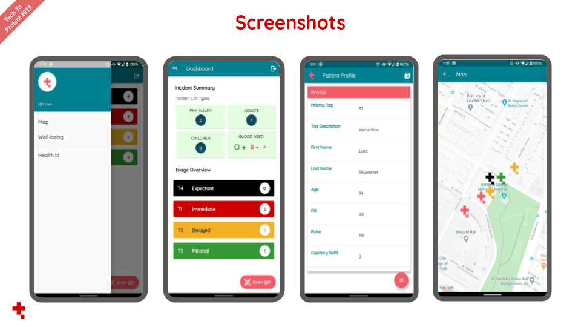
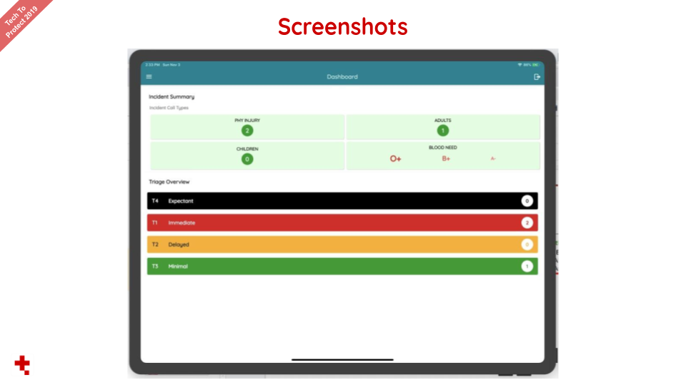
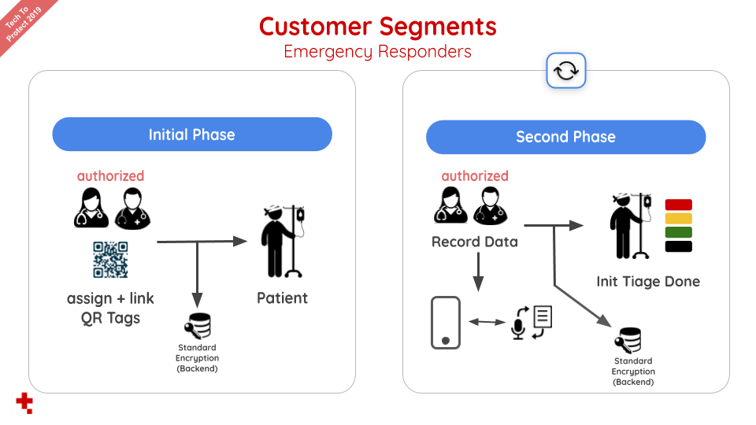
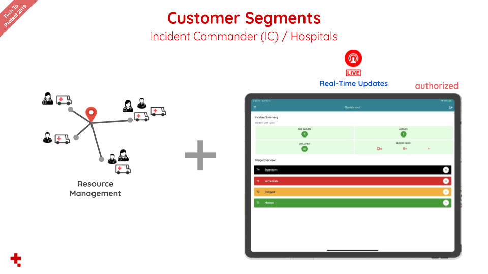

# eTriage

## Project Summary

Triige is able to quickly assess the severity of each victim’s condition and assign each person a priority for immediate treatment. It does this by attaching QR codes preprogrammed with SHA-256 encryption hashes to patients at the scene. First responders scan the QR code and input a patient’s data either manually or by using voice commands. Entered inputs are stored on a Flask server in the IBM Cloud. This information can be retrieved from the IBM Cloud by GET & POST requests. Our user interface (UI) is simple and easy to use while allowing for first responders to see a variety of aggregate data such as the amount of blood needed. We comply with the HIPPA standards since all data is stored on the IBM Cloud along with leveraging all the security features provided by the cloud. Additionally, no patient health information is stored on QR codes to protect the patient’s privacy.

- [Demo Slides](https://github.com/dhruvilp/triige/blob/master/screenshots/demo_slides.pdf)

## Getting Started With Flutter

This project is a starting point for a Flutter application.
- [Install Fluter](https://flutter.dev/docs/get-started/install)

A few resources to get you started if this is your first Flutter project:

- [Lab: Write your first Flutter app](https://flutter.dev/docs/get-started/codelab)
- [Cookbook: Useful Flutter samples](https://flutter.dev/docs/cookbook)

For help getting started with Flutter, view our
[online documentation](https://flutter.dev/docs), which offers tutorials,
samples, guidance on mobile development, and a full API reference.

## Triige Backend Repository
- [Triige Backend Repository](https://github.com/PJprogrammer/triige_backend)

## Get Google Maps API Key
Get an API key at https://cloud.google.com/maps-platform/

### Android:
    Go to /triige/android → local.properties file
    ADD: default.apikey.googlemaps=YOUR_API_KEY

### iOS:
    Go to /triige/ios/Runner → AppDelegate.swift file
    ADD: GMSServices.provideAPIKey("YOUR_API_KEY")

## Sample QR Code to Scan
Please generate qr codes of these strings (they're stored in our DB):

* `02be2b2627b3de95bb396c71c7cc89f9`
* `803b4817ee8305b8164627b88fbe62fb`

### Email Us For Login Credentials

If you have any issues regarding getting started with Triige, feel free to email Dhruvil (atdhruvilpatel@gmail.com) or Paul (pauljprogrammer@gmail.com). Thanks!